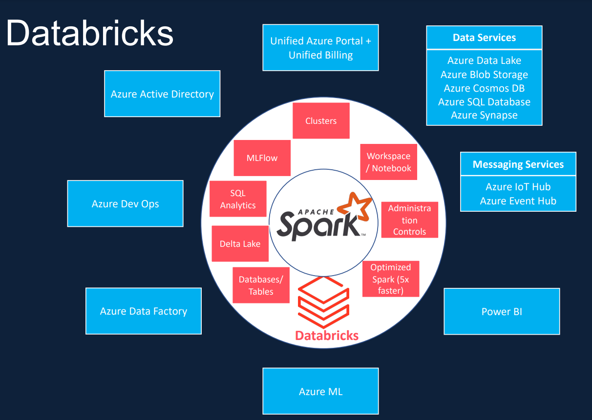
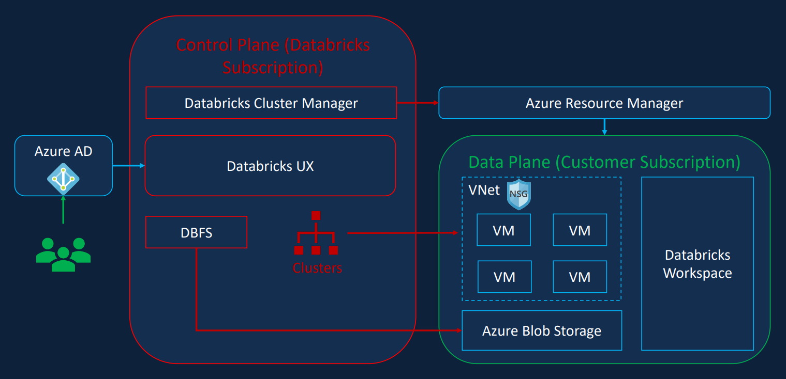
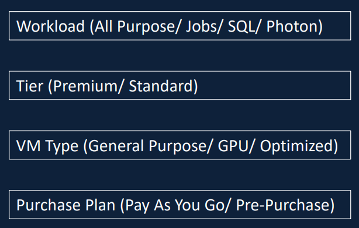
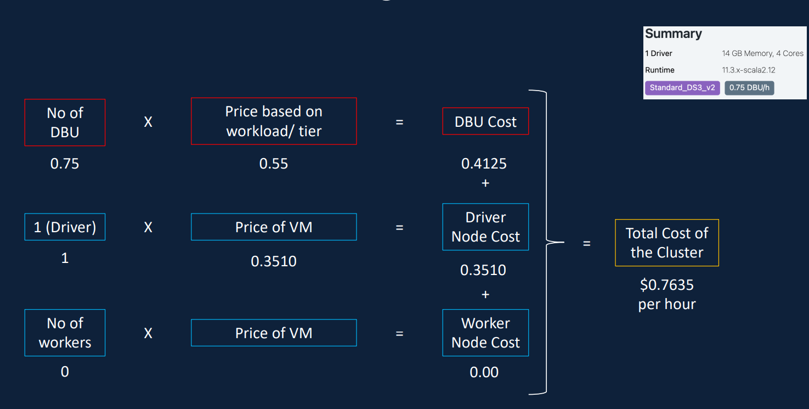
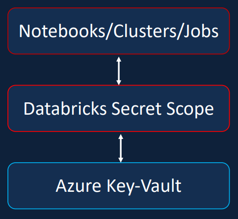
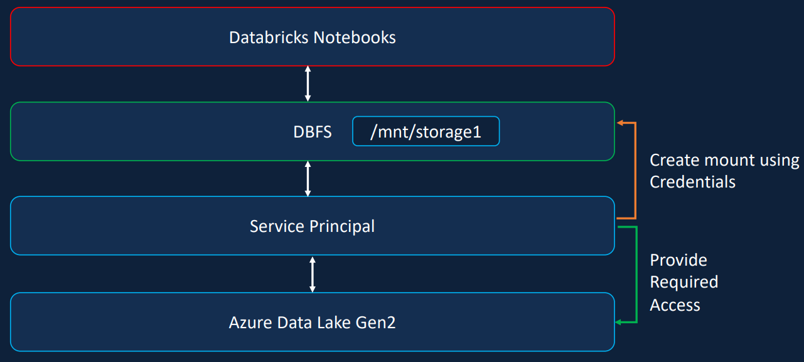

# 0. Repo greetings

Hi there, welcome to my notes on the Azure Databricks and Spark for Data Engineer

This is my first step into cloud services for DE tasks, projects. This repo got all the codes, the notes are in this README.md but not the steps I took to enable the services though. So, if you're here for the steps to navigate the services, this is NOT the place.

Well, without further ado, let's get to the contents/notes I jot down on this course. Enjoy!

# 1. Introduction to Azure Databricks

**TL;DR**: Azure Databricks is a Spark unified data analytics platform that is optimized for Microsoft Azure Cloud

# 2. Architecture

What we interact with:
- Azure Blob Storage
- VNet (Cluster Configs)
- Codes in Databricks Workspace

# 3. Cluster Configurations
## a. Node

| Category | Single | Multi |
| -- | -- | -- |
| Number of Nodes | 1 as both driver and worker | 1 as driver, the rest as workers |
| Scalability | No | Yes (MORE NODES) |
| Task | Simple (small ML, data analytics) | Extensive workloads (ETL/ELT) |

## b. Access Modes

| Category | Single | Shared | No Isolation Shared |
| -- | -- | -- | -- |
| Number of Users | 1 | 1 or more | 1 or more |
| Non-premium | Yes | No | Yes |
| Supported Languages | Python, SQL, Scala, R | Python, SQL | Python, SQL, Scala, R |
| Session Isolation | x | Yes (each user has their own processes, resources) | No (failure in one user's process or extensive use of resources may affect others) |

## c. Runtimes

- Standard: Spark and Delta Lake
- ML: Standard + popular ML libs
- Photon: Standard + Photon Engine (SQL faster)
- Light: no interactive workloads or notebooks (for automated jobs)

## d. Cluster Types/Sizes

- Memory: Jobs that RAM
- Compute: Jobs that process a lot
- Storage: Jobs that need I/O
- General Purpose: a bit of all (Enterprise recommended)
- GPU: Jobs that AI/DL/ML

## e. Policies (Premium only)

- Simplifiy UI
- Enable cluster creation for users
- Control COST

## f. Autos

Termination:
- Cluster terminates after certain time of inactivity
- Default at 120 mins
- Between 10 and 10000 mins

Scaling:
- Cluster scales between MIN and MAX nodes for the workload
- User can specify MIN and MAX nodes
- NOT RECOMMENDED for *streaming*

# 4. Pricing Calculation

What to look out for:

Sample calcuation:

# 5. Acessing Azure Data Lake Storage Gen2

## a. Access keys:

The why:
- Each storage account comes with 2 keys
- Give full access to the storage account

The how:
- Get the access key (1 of them) information
- Set the Spark config fs.azure.account.key

## b. SAS (Shared Access Signature) Token:

The why:
- Provide fine grained/detailed access to the storage
- That's basically it. It's **TIGHT** on permissions, restrictions, time and IP Address

The how:
- Get the SAS Token from the folder in the container.
- Set the Spark config for SAS Token *(search the [DOCS](https://learn.microsoft.com/en-us/azure/databricks/connect/storage/azure-storage))*

## c. Service Principal (Premium):

The why:
- Application-level registration
- Better security

The how:
- Register Azure AD Application / Server Principal
- Generate a secret/password for the application
- Set Spark config with Client ID, Tenant ID and Secret
- Assign role Storage Blob Data Contributor to the Data Lake

## d. Cluster-level Authentication:

The why:
- Convenient since we don't need to re-configure authentication **within** the notebook

The how:
- Pretty much like [Access keys](#a-access-keys), except, the config is set right in the cluster's advanced configurations

## e. User-level Authentication (AAD Credential Passthrough, Premium):

The why:
- One of the more recommended practice, each user has their own permission, restrictions upon accessing data

The how:
- Go to IAM to set the role Storage Blob Data Contributor to the user
- You're good to go *(see the Go-go open-close there, I'm not proud)*

# 6. Securing Secrets in Azure

The why:
- The only why is is that why you ask this question
- Plain text secret **BAD**, encrypt them
- Or just let Azure, or any other services handle it

The how:
- Create a secret vault (Azure Key-Vault)
- Create a DB Secret Scope (it will ask for Vault info)
- dbutils.secrets.get(scope, key) will yeild the password (only show us REDACTED but trust)

# 7. Mounting Data Lake Container to Databricks

It's a recommended way due to convenience:
- Accessing files now use file semantics, rather than storage URLs
- Files are stored in Azure Blob &rarr; All benefits from Azure

# 8. Spark SQL Temp Views

| Category | Local | Global |
| -- | -- | -- |
| Syntax | createOrReplaceTempView(*<view_name>*) | createOrReplaceGlobalTempView(*<view_name>*) |
| Access | *<view_name>* | **global_temp**.*<view_name>* |
| Scope | Within 1 notebook | Within 1 cluster (multiple notebooks) |

# 9. Data Architecture in Azure Databricks

- Object Storage: Azure Data Lake
- Metadata Storage (location, schema...): Hive Meta Store
- Access Tool: Spark SQL

    

    | Category | Managed Table | External Table |
    | -- | -- | -- |
    | Data | by Spark | by us |
    | Metadata | by Spark | by Spark |
    | Deletion | both meta and data is ***gone*** | only meta is ***gone*** |

    

# 10. Delta Lake Architecture

Basically, Delta Lake is built on the concept of Data Lakehouse, which provides ACID transaction to Data Lake

# 11. Azure Data Factory

Basically Airflow with more functions, integration with other services and security assurance

